# Day 23 – 网络层优化方案（3 小时冲刺 + 深化扩展 6 小时）

> **使命**：在不触碰现有 UI、领域模型与接口契约的前提下，把网络层从「够用」升级为「面向亿级并发依然稳健」。本文件包含两部分：
>
> 1. **核心 4 能力** — 3 小时即可交付的 P0 特性；上线后立刻受益。
> 2. **扩展 10 能力** — 再追加 6 小时集成，完成端到端强化与观测闭环。
>
> 由于项目节奏紧凑，所有改动以 **Interceptor / Singleton / DI 可插拔** 为设计原则，可一键开关、分钟级回滚。

---

## 目录

1. 请求合并机制
2. 网络状态感知
3. 超时 & 重试策略优化
4. 请求优先级管理
5. 任务分解 & 里程碑
6. 风险矩阵与回滚策略
7. 性能指标与预期收益
8. 扩展功能（6 小时追加）
9. 测试矩阵（单元 / 集成 / E2E）
10. 交付清单与验收标准
11. 参考资源 & 下一步

---

## 1. 请求合并机制（30 min）

### 1.1 动机

在首页下拉、搜索联想、背景预取等场景中，同一个接口往往被多次并发调用，消耗多余带宽；引入 **Coalesce** 可立即把相同请求归并，降低 RTT 与耗电。

### 1.2 实现要点

| 组件                      | 职责                 | 备注                                                           |
| ----------------------- | ------------------ | ------------------------------------------------------------ |
| **RequestKey**          | 用于对比两个请求是否等价       | 拼接 `method_baseUrl_endpoint_sortedQuery_md5(body)`           |
| **PendingPool**         | 保存首个请求创建的 Deferred | `ConcurrentHashMap<String, CompletableDeferred<Response>>()` |
| **CoalesceInterceptor** | 在真正发网前检查池 & 复用     | 放在 AuthInterceptor **之后**，保证 token 已注入                       |
| **CoalesceMetrics**     | 埋点 trace：命中 / 未命中  | 用于 Grafana 面板                                                |

#### 1.2.1 Code Skeleton

```kotlin
object RequestCoalescer {
    private val pool = ConcurrentHashMap<String, CompletableDeferred<Response>>()

    suspend fun enqueue(key: String, producer: suspend () -> Response): Response {
        val deferred = pool.getOrPut(key) {
            CompletableDeferred<Response>().also { d ->
                try { d.complete(producer()) }
                catch (t: Throwable) { d.completeExceptionally(t) }
                finally { pool.remove(key) }
            }
        }
        return deferred.await()
    }
}
```

调用示例：

```kotlin
suspend fun BookService.fetchBook(id: String) =
    RequestCoalescer.enqueue("GET_api/books/$id") { api.getBook(id) }
```

### 1.3 监控维度

* **coalesce\_hit\_rate** = hit / (hit + miss)
* **avg\_wait\_ms** — 命中情况下的额外等待
* **pool\_size\_max** — 理论上线；大于 100 需报警

---

## 2. 网络状态感知（40 min）

### 2.1 目标

动态感知 **Wi‑Fi / 蜂窝 / 无网 / 受限热点**，并实时驱动：

* Prefetch 开关、并发数
* 超时 / 重试窗口

### 2.2 NetworkMonitor API

```kotlin
enum class NetType { WIFI, CELLULAR, NONE }
interface NetworkMonitor {
    val flow: StateFlow<NetType>
    fun now(): NetType
}
```

实现细节：

* 使用 `ConnectivityManager.registerDefaultNetworkCallback` 监听；
* 对快速抖动（0‑1‑0‑1）加 300 ms debounce；
* 由 Hilt 提供 `@Singleton`；组件间通过 constructor 注入。

### 2.3 Sample Usage

```kotlin
class IntelligentPrefetcher @Inject constructor(private val nm: NetworkMonitor) {
    suspend fun maybePrefetch(chapterId: Int) {
        if (nm.now() == WIFI) launchHighConcurrency(chapterId)
    }
}
```

---

## 3. 超时与重试策略优化（50 min）

### 3.1 自适应超时矩阵

| 网络    | connectTimeout | readTimeout | callTimeout |
| ----- | -------------- | ----------- | ----------- |
| Wi‑Fi | 5 s            | 10 s        | 15 s        |
| 4G/5G | 6 s            | 15 s        | 25 s        |
| 2G/3G | 8 s            | 25 s        | 35 s        |
| 无网    | —              | —           | 0 s（直接读取缓存） |

时间值注入 `OkHttpClient.Builder`，由 `TimeoutProvider` 评估。

### 3.2 指数退避重试

```kotlin
class RetryInterceptor(private val nm: NetworkMonitor) : Interceptor {
    override fun intercept(chain: Interceptor.Chain): Response {
        var attempt = 0
        var backoff = 500L
        while (true) {
            try { return chain.proceed(chain.request()) }
            catch (e: IOException) {
                if (++attempt > max(attemptLimit(), nm.now())) throw e
                Thread.sleep(backoff)
                backoff = (backoff * 1.5).toLong() // 指数提升
            }
        }
    }
    private fun attemptLimit() = 3 // runtime configurable
}
```

### 3.3 条件化重试（OkHttp5 Conditions）

升级后使用新版 DSL：

```kotlin
client.followUp { req, res ->
    when (res.code) {
        502, 503 -> RetryDecision.retryAfter(backoff())
        408 -> RetryDecision.retryImmediately()
        else -> RetryDecision.noRetry()
    }
}
```

---

## 4. 请求优先级管理（40 min）

### 4.1 Priority Tag + Dispatcher

```kotlin
enum class Priority(val weight: Int) { HIGH(3), MEDIUM(2), LOW(1) }
```

创建自定义 `PriorityExecutorService` 替换 OkHttp 的默认 `dispatcher.executorService`，内部用 `PriorityBlockingQueue<Runnable>`。

### 4.2 接入示例

```kotlin
api.fetchHome().withPriority(Priority.HIGH).await()
```

内部 extension：

```kotlin
fun <T> Call<T>.withPriority(p: Priority) =
    this.apply { request().newBuilder().tag(Priority::class.java, p).build() }
```

### 4.3 快捷策略

* **用户可见** 请求 → HIGH
* **后台同步** → MEDIUM
* **预测/预取** → LOW，但在 Wi‑Fi 可自动升级 MEDIUM

---

## 5. 任务分解 & 里程碑

```mermaid
gantt
dateFormat  HH:mm
title 3h Core Sprint
section 合并
Coalescer                        :a1, 00:00, 30m
section 网络感知
NetworkMonitor                   :b1, 00:30, 40m
section 超时 & 重试
AdaptiveTimeout + Retry          :c1, 01:10, 50m
section 优先级
PriorityDispatcher               :d1, 02:00, 40m
section 收尾
QA + Smoke + PR                  :e1, 02:40, 20m
```



---

## 6. 风险矩阵与回滚策略

| 风险    | 触发条件                   | 影响             | 监控指标                          | 回滚方案                                  |
| ----- | ---------------------- | -------------- | ----------------------------- | ------------------------------------- |
| 合并死锁  | 代码异常未 `remove(key)`    | 其他请求永悬挂        | pool\_size\_stuck>0 for 10 s  | FeatureFlag: `coalesce_enabled=false` |
| 退避耗时  | 海外弱网 + 多次重试            | UI Loading 漫长  | avg\_call\_time > 30 s        | 将 `retry_limit=0`                     |
| 优先级失衡 | Dispatcher 队列饿死        | Prefetch 阻塞 UI | low\_priority\_wait\_ms > 5 s | 调高 weight, 或关闭调度器                     |
| 监听抖动  | ROM 改写 NetworkCallback | 状态频繁切换         | net\_switch\_per\_min > 20    | 加大 debounce 到 1 s                     |

---

## 7. 性能指标与预期收益

* **RTT 降幅**：同 Key 请求平均合并 1.6 次，首页首屏总下载时长 ‑12 %。
* **成功率**：弱网下 GET 成功率 88 → 98 %。
* **电量**：30 min 阅读耗电从 4.8 % 降至 4.4 %。
* **稳定性**：CrashFree 维持 99.93 %+；新增网络代码覆盖率 ≥ 85 %。

---

## 8. 扩展功能（追加 6 小时冲刺）

> **总览**：扩展层目标是让网络栈在上线即具备 **观测可视化、智能调参、协议升级、边缘协同** 四大能力。本轮 6 小时冲刺拆为 10 个微迭代，每迭代产出可独立回滚。以下为每子任务的 **实现步骤（Step‑by‑Step）**、关键代码或脚本示例、测试要点与 Gray Rollout 策略。

### 8.1 OkHttp5 Conditions & 条件化重试（\~30 min）

1. **依赖升级** — `build.gradle` ➜ `implementation(platform("com.squareup.okhttp3:okhttp-bom:5.0.0-alpha.11"))`；替换旧 4.x 引用。
2. **封装 Facade** — 建立 `ConditionRetryInterceptor.kt`：

   ```kotlin
   class ConditionRetryInterceptor : Interceptor {
       private val strategy = retryStrategy {
           retryOn<IOException>()   // 网络抖动
           retryIfStatusCode(502..504, 408) { delay(backoff()) }
           maxRetries = 3
       }
       override fun intercept(chain: Chain) = strategy.proceed(chain)
   }
   ```
3. **Client 装配** — 在 `NetworkModule` 注入 `.addInterceptor(ConditionRetryInterceptor())`；通过 DI Flag `retry_conditions_enabled` 控制开启。
4. **单元测试** — 使用 `MockWebServer` 返回 502 序列，断言最后成功 & 重试次数 ≤ 3。
5. **灰度发布** — RemoteConfig 5% → 30% → 100%，观测 `retry_success_rate`、`avg_call_time`。异常回滚：Flag 关闭即可。

### 8.2 RequestCoalescer 持久化（\~45 min）

1. **Room Schema** — 新表 `coalesce_cache(key TEXT PRIMARY KEY, body BLOB, ts LONG)`；`ts` 用于 TTL。
2. **DAO** — `upsert(List<CoalesceEntity>)`、`deleteExpired(cutoff)`；创建 `@Query("DELETE FROM coalesce_cache WHERE ts < :cutoff")` 定时清理。
3. **Write‑Ahead Batch** — 在内存池完成后异步 `launch(IO) { dao.upsert(batch) }`，避免主线程 I/O。
4. **跨进程锁** — `CrossProcessMutex("coalesce.lock")` 使用 `FileChannel.tryLock()`；保证多进程同步写。
5. **集成点** — `RequestCoalescer.enqueue` 成功后向 DAO 写入；新进程启动先预热缓存到内存池。
6. **回滚** — 统一 Flag `coalesce_persist_enabled`；数据库 Migration 可前向兼容，无需数据回收。

### 8.3 WorkManager 离线重试桥接（\~30 min）

1. **RetryWork 数据类** — `@Parcelize data class RetryTask(val req: SerializedRequest, val attempt: Int) : Parcelable`。
2. **拦截器挂钩** — 在 `ConditionRetryInterceptor` 最终 give‑up 处 `enqueueRetryWork(task)`；使用 `OneTimeWorkRequestBuilder<RetryWorker>`，约束 `setRequiredNetworkType(NOT_ROAMING)`。
3. **RetryWorker** — 读取 `RetryTask`，判网络好再复发；成功即调用 `WorkManager` `Result.success()` 并清缓存。
4. **Instrumentation Test** — 利用 `TestDriver` 模拟后台 → 前台切网场景。

### 8.4 Grafana 可观测面板（\~60 min）

1. **指标埋点** — 通过 `PrometheusMeterRegistry` 注册 `coalesce_hit_rate`, `retry_count`, `priority_wait_ms`。
2. **PushGateway** — Side‑car 进程每 15 s 推送到 Prom；使用 `Job="mobile_${BuildConfig.FLAVOR}"` 打标签。
3. **Grafana JSON** — 创建 3 row：Overall、Coalesce、Retry；使用 `Heatmap` 展示 RTT 分布。
4. **CI 验证** — `scripts/validate_dash.py` 确保仪表 JSON 可被导入。

### 8.5 Priority Dispatcher 灰度实验（\~40 min）

1. **RemoteConfig Key** — `priority_weights = "3,2,1"`；动态下发队列权重。
2. **Experiment Layer** — AB SDK 按装置 `instance_id % 2` 划分 Control/Test。
3. **Metrics** — 比较 `home_tti`, `prefetch_timeout`；数据进 Amplitude + BigQuery 分析。

### 8.6 自动调参引擎（\~50 min）

1. **行为画像** — `ReadingBehaviorAnalyzer` 输出 `NetScore` 0‑100；基于 session 时长、页面数、网络状态。
2. **Rule Engine** — Kotlin DSL：`when(netScore) in 0..30 -> Profile.POWER_SAVE`；Profiles 定义 timeout、concurrency。
3. **实时下发** — 监听 `NetScore` Flow，30 s 更新一次 OkHttp Dispatcher 设置。
4. **Canary Test** — 开启 1% 用户，观察 `battery_drain`, `crash_rate`。

### 8.7 HTTP/3‑QUIC / gRPC 预研（\~60 min）

1. **PoC 环境** — Cloudflare Dev Tunnel 开启 QUIC；后端 Nginx 1.25 启 `quic_reuse_port`。
2. **客户端** — 使用 OkHttp5 `enableQuic = true`；gRPC‑Kotlin `GrpcOkHttpChannelBuilder.forTarget(...)`。
3. **Benchmark** — `JMH` 测 1000 并发 cold‑start；记录 `handshake_ms`, `p95_rtt`。
4. **决策门槛** — 若 `p95_rtt` Wi‑Fi 降幅 ≥ 10 % 且 Crash 不增，则纳入未来版本 Roadmap。

### 8.8 EdgeCache Header 协议合并（\~30 min）

1. **协议草案** — `X-Edge-Cache: hit|miss; ttl=3600; variant=wifi`；支持变体分类。
2. **服务端** — Varnish 配置 `vcl_hash` 加入 `variant`；回源设置 `stale‑while‑revalidate`。
3. **客户端** — `EdgeCacheInterceptor`: 如 header `variant` ≠ 当前 NetType 则降级本地缓存。

### 8.9 Predictive Prefetch（MLKit）（\~45 min）

1. **训练** — 采 30 天阅读序列，特征：章节 ID、停留时间、白天/夜晚、网络。
2. **模型** — `TensorFlow Lite + GradientBoostedTrees`；输出概率 `P(next_chapter)`。
3. **在线推理** — 每翻页后调用 `Predictor.score(...)`; 大于阈值 0.6 则 `IntelligentPrefetcher.prefetch()`。
4. **评估** — 指标 `prefetch_hit_rate`, `extra_data_mb`; 回滚：Flag `predict_prefetch_enabled`。

### 8.10 MPTCP / Multipath QUIC 试验（\~50 min）

1. **系统检查** — 仅在支持 MPTCP 的 Android 13+ 机型启用；检测 `net.ipv4.mptcp_enabled`。
2. **Channel 抽象** — `MultipathSocketFactory` 注入到 OkHttp，根据 `NetType` 选择 Wi‑Fi + Cellular link。
3. **吞吐对比** — 下载 100 MB PDF，监测 `avg_speed_mbps`；目标 ≥ 1.3× 单链路。
4. **用户开关** — 设置项「极速下载 Beta」，默认关闭。

> **迭代完成判定**：以上 10 子任务全部通过 UT/IT/E2E 且 Grafana 指标无异常，则扩展功能标记 **Done**。

---

## 9. 测试矩阵（单元 / 集成 / E2E） 测试矩阵

### 9.1 单元（JUnit5 + Turbine）

* RequestKey 算法：50+ 随机化组合
* RetryInterceptor：模拟 IOException / HTTP 502‑504

### 9.2 组件（Compose UITest + RN Testing‑Library）

* Loading Skeleton ≤ 200 ms
* Prefetch 开关互斥逻辑

### 9.3 集成（GMD + Detox）

* 畅通网络 / 断网 / 切网
* Wi‑Fi → LTE 切换场景

### 9.4 E2E 指标回归

* 谷歌 Pixel 5 / Samsung S22 / Redmi K70

---

## 10. 交付清单与验收标准

1. PR 合并：`network/feature-day23` ➜ `develop` 分支
2. CI 全绿：Unit > 90 %、Lint 0 Error、Detekt 0 Warning
3. 性能对比基线脚本 `scripts/compare_rtt.py` 输出 **PASS**
4. QA 回归用例 **Net‑42**～**Net‑63** 全通过
5. Grafana Dashboard URL 在 Wiki 更新

---

## 11. 参考资源 & 下一步

* OkHttp5 RFC & Quic 提案
* Google Mobile Networking Best Practices 2024
* Firebase Performance Cookbook
* EdgeCache Internal Memo v2
* 《高性能移动网络设计实践》（陈皓，2023）

> **下一步方向**：
>
> * **HTTP/3 全站灰度** — 自建测试网关验证 0‑RTT 与 Head‑of‑line Blocking 改善；
> * **动态链路聚合** — 基于 MPTCP/Multipath QUIC 评估异构网络叠加吞吐；
> * **离线包增量推送** — 架设 Delta CDN，减少冷启动 40 %以上。

---

## 12. 深度讲解（Why & How）

### 12.1 请求合并机制内幕

| 维度         | 设计选择                                               | 讨论                                     | 可选方案                                   |
| ---------- | -------------------------------------------------- | -------------------------------------- | -------------------------------------- |
| **Key 组成** | `method + host + path + sorted(query) + md5(body)` | 避免同 GET 不同顺序缓存穿透；Body 摘要仅取前 16 KB，兼顾速度 | 使用 \[RFC 3986 正则化 URI] 但实现复杂           |
| **并发同步**   | `CompletableDeferred` + CAS                        | 无锁等待，与 RxJava `ReplaySubject` 相比内存更低   | Kotlin `Channel` 则需 hand‑back pressure |
| **错误传播**   | 原始 Exception 透传到所有 await 者                         | 调用方可区分 4xx/5xx；若只返回首个成功会隐藏重试失败         | 可以配置 `onErrorResume` fallbacks         |

> **边界情形**：
>
> * **超大上传**：Body Stream 不可重复读取，不进合并池。
> * **文件下载**：因返回流消耗一次，也不进池。
> * **慢请求失活**：超 30 s 未完成自动剔除 `pool.remove(key)`，防内存泄漏。

### 12.2 网络状态感知细节

1. **监听 API 差异**：Android 9 后 `ConnectivityManager.NetworkCallback` 是主推方案；低版本回落 `BroadcastReceiver`。
2. **能耗考量**：回调本身几乎免费，关键是后续逻辑；Prefetch 在蜂窝网严控 `maxConcurrent=2`。
3. **跨进程复用**：将 NetType 存至 `ProcessSharedPreferences`，子进程无需再次注册 Callback。

### 12.3 超时 & 重试算法推导

* **数据来源**：采样 1 周真实 RTT，分位数：Wi‑Fi p90≈1 s；4G p90≈1.8 s；据此取 5×p90 作为 readTimeout 基线。
* **指数退避参数**：起始 0.5 s，倍率 1.5；理论期待重试 3 次总等待 ≈ 2 s。
* **条件化重试**：只针对 502/503/504/408；对 4xx 直接失败，防止对无权限/无资源浪费带宽。
* **与 OkHttp RetryAndFollowUpInterceptor 区分**：后者仅对少数场景重连；我们扩展 header‑based 重试。

### 12.4 请求优先级调度设计抉择

* **为何不用 FIFO**：在首页滑动快刷时，Prefetch 带宽可完占队列，导致点击详情卡顿。
* **带权队列**：HIGH(3) : MEDIUM(2) : LOW(1) 约等于 60 : 25 : 15 % CPU 分配。
* **饿死保护**：调度器每 100 ms 抽样，如果 LOW 超 1 s 未出队，则提升其权重 +1 临时救济。
* **多 Dispatcher 策略**：下载大文件走独立 Dispatcher，防止长连接占满槽。

### 12.5 扩展功能实现路径

| 子任务                    | 深入要点                                                    | 风险 & 缓解                                            |
| ---------------------- | ------------------------------------------------------- | -------------------------------------------------- |
| **OkHttp5 Conditions** | 升级到 5.0‑alpha11；`client.followUp` 统一处理                  | Alpha 版本 API 变动频繁 → 封装 Facade 隔离                   |
| **Pool 持久化**           | Room＋条目 TTL 60 s；索引 key                                 | DB 热点写放大 → 增加 Write‑Ahead batching                 |
| **WorkManager 桥接**     | 失败任务序列化入 DB，再由 `RetryWorker` 调度                         | 系统 Doze 模式 → 设立 `setRequiresBatteryNotLow`，确保重试不拖电 |
| **Grafana 面板**         | PushGateway + Prom + Loki 日志关联                          | 时间序列错位 → 设置统一时钟 via NTP                            |
| **自动调参**               | `ReadingBehaviorAnalyzer` 输出 NetScore；用规则引擎切换 Timeout 表 | 行为数据噪声 → 平滑 5 min 滑窗平均                             |

> **Tip**：所有扩展功能均挂 **RemoteConfig Flag**，可随时渐进放量。

---
